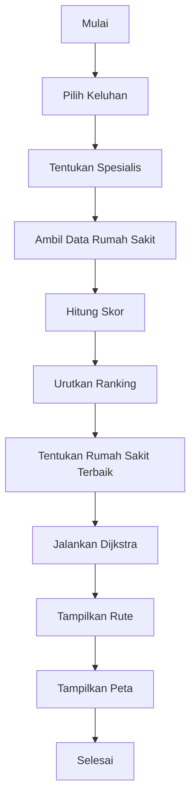
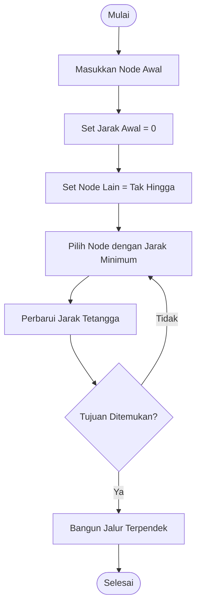
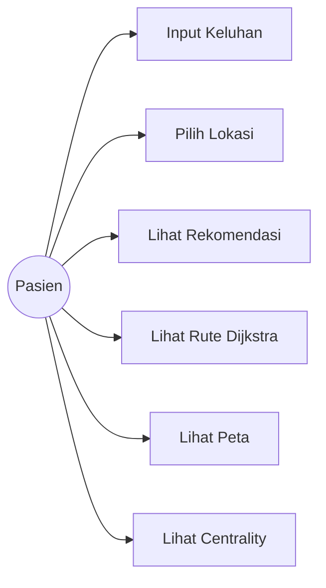
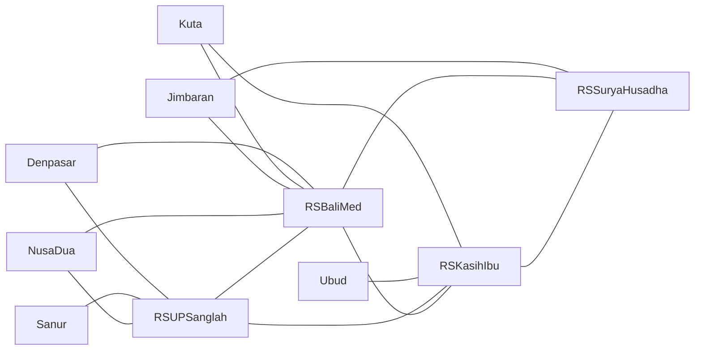

# UAS Struktur Data Graph

# Decision Support System (DSS) Rekomendasi Rumah Sakit di Bali

## BAB 1 – PENDAHULUAN

### 1.1 Latar Belakang

Pemilihan rumah sakit yang tepat merupakan hal penting dalam pelayanan kesehatan. Pasien sering mengalami kesulitan menentukan rumah sakit yang sesuai dengan kebutuhan medis, jarak tempuh, serta kualitas pelayanan yang tersedia.

Perkembangan teknologi memungkinkan penerapan Decision Support System (DSS) untuk membantu pengambilan keputusan secara cepat dan objektif. Dalam penelitian ini dibangun sebuah DSS rekomendasi rumah sakit di Bali menggunakan struktur data Graph dan algoritma Dijkstra untuk menentukan rute terbaik menuju rumah sakit yang direkomendasikan.

Selain itu, sistem juga memanfaatkan Degree Centrality untuk menganalisis tingkat keterhubungan antar rumah sakit serta menggunakan pendekatan rekomendasi spesialis berdasarkan keluhan pasien.

### 1.2 Rumusan Masalah

1. Bagaimana membangun sistem rekomendasi rumah sakit berbasis graph?
2. Bagaimana menentukan rute terpendek menuju rumah sakit yang direkomendasikan?
3. Bagaimana menganalisis keterhubungan rumah sakit menggunakan centrality?
4. Bagaimana memberikan rekomendasi rumah sakit berdasarkan spesialis yang dibutuhkan pasien?

### 1.3 Tujuan

1. Membangun DSS rekomendasi rumah sakit berbasis graph.
2. Mengimplementasikan algoritma Dijkstra untuk pencarian rute terpendek.
3. Mengimplementasikan Degree Centrality untuk analisis node.
4. Menampilkan hasil rekomendasi dalam bentuk visualisasi interaktif.

### 1.4 Manfaat

#### Bagi Pasien

* Membantu memilih rumah sakit yang sesuai kebutuhan.
* Memperoleh informasi rute menuju rumah sakit.

#### Bagi Akademik

* Sebagai implementasi struktur data graph dalam kasus nyata.
* Sebagai contoh penerapan DSS menggunakan algoritma graph.

#### Bagi Pengembang

* Menjadi dasar pengembangan sistem kesehatan berbasis GIS dan AI.

---

# BAB 2 – DASAR TEORI

## 2.1 Struktur Data Graph

Graph merupakan struktur data yang terdiri dari:

### Node (Vertex)

Merepresentasikan objek.

Pada sistem ini:

* Lokasi pasien
* Rumah sakit

### Edge

Merepresentasikan hubungan antar node.

Contoh:

Denpasar → RSUP Sanglah = 3 km

### Weighted Graph

Setiap edge memiliki bobot berupa jarak tempuh.

---

## 2.2 Decision Support System (DSS)

Decision Support System adalah sistem yang membantu pengguna dalam proses pengambilan keputusan berdasarkan data dan model tertentu.

Pada sistem ini DSS digunakan untuk:

* Menentukan rumah sakit terbaik.
* Menentukan spesialis yang sesuai.
* Menentukan rute terpendek menuju rumah sakit.

---

## 2.3 Algoritma Dijkstra

Algoritma Dijkstra digunakan untuk mencari lintasan terpendek dari node sumber menuju node tujuan.

Langkah-langkah:

1. Tentukan node awal.
2. Beri nilai 0 pada node awal.
3. Beri nilai tak hingga pada node lain.
4. Pilih node dengan jarak terkecil.
5. Perbarui jarak tetangga.
6. Ulangi sampai tujuan ditemukan.

Kelebihan:

* Cepat.
* Cocok untuk graph berbobot positif.

---

## 2.4 Degree Centrality

Degree Centrality digunakan untuk mengukur tingkat keterhubungan suatu node.

Rumus:

Centrality(v) = Degree(v) / (n - 1)

Semakin tinggi nilai centrality, semakin penting posisi node dalam jaringan.

---

# BAB 3 – ANALISIS DAN PERANCANGAN

## 3.1 Analisis Masalah

Pasien membutuhkan informasi:

* Rumah sakit yang sesuai spesialis.
* Rumah sakit dengan kualitas terbaik.
* Jalur tercepat menuju rumah sakit.

Permasalahan tersebut dapat dimodelkan menggunakan graph.

---

## 3.2 Desain Graph

Node:

* Denpasar
* Kuta
* Sanur
* Ubud
* Jimbaran
* Nusa Dua
* RSUP Sanglah
* RS BaliMed
* RS Kasih Ibu
* RS Surya Husadha

Edge:

* Menghubungkan lokasi dan rumah sakit.
* Menghubungkan rumah sakit satu sama lain.

Bobot:

* Jarak dalam kilometer.

---

### Flowchart Sistem

### 3.3 Flowchart Algoritma Dijkstra

## 3.4 Use Case

### Use Case Diagram

### 3.5 Struktur Graph

# BAB 4 – IMPLEMENTASI

## 4.1 Implementasi Program

Bahasa Pemrograman:

* Python

Framework:

* Streamlit

Library:

* Pandas
* NetworkX
* Folium
* Matplotlib

---

## 4.2 Penjelasan Kode

### graph_data.py

Berfungsi menyimpan:

* Data rumah sakit
* Struktur graph

Output:

graph dan dataframe.

---

### dijkstra.py

Mengimplementasikan algoritma Dijkstra untuk mencari jalur terpendek.

Output:

* Cost
* Path

---

### centrality.py

Menghitung Degree Centrality setiap node.

Output:

Nilai centrality seluruh node.

---

### ai_recommendation.py

Mengubah keluhan pasien menjadi spesialis yang sesuai.

Contoh:

Nyeri Dada → Jantung

Sesak Nafas → Paru

---

### app.py

Merupakan antarmuka utama aplikasi.

Fitur:

* Input pasien
* Ranking rumah sakit
* Visualisasi peta
* Visualisasi graph
* Analisis centrality

---

## 4.3 Tampilan Sistem

### Halaman Utama

Menampilkan:

* Input keluhan
* Lokasi pasien
* Tombol pencarian

### Peta Interaktif

Menampilkan:

* Lokasi rumah sakit
* Lokasi pasien
* Rute rekomendasi

### Visualisasi Graph

Menampilkan node dan edge graph menggunakan NetworkX.

### Tabel Centrality

Menampilkan tingkat keterhubungan setiap rumah sakit.

---

# BAB 5 – PENGUJIAN DAN ANALISIS

## 5.1 Skenario Pengujian

### Pengujian 1

Input:

Keluhan = Nyeri Dada

Lokasi = Denpasar

Output:

Spesialis = Jantung

Rekomendasi Rumah Sakit = RSUP Sanglah

Status = Berhasil

---

### Pengujian 2

Input:

Keluhan = Sesak Nafas

Lokasi = Kuta

Output:

Spesialis = Paru

Rekomendasi Rumah Sakit = RS BaliMed

Status = Berhasil

---

## 5.2 Analisis Hasil

Sistem berhasil:

* Menentukan spesialis berdasarkan keluhan.
* Memberikan ranking rumah sakit.
* Menampilkan rute terpendek.
* Menampilkan visualisasi graph.
* Menampilkan analisis centrality.

---

## 5.3 Kompleksitas Algoritma

### Dijkstra

Kompleksitas waktu:

O(V²)

atau

O((V + E) log V)

jika menggunakan priority queue.

### Degree Centrality

Kompleksitas:

O(V + E)

karena seluruh node dan edge diperiksa satu kali.

---

# BAB 6 – KESIMPULAN

## 6.1 Kesimpulan

1. Struktur data graph berhasil diterapkan pada sistem rekomendasi rumah sakit.
2. Algoritma Dijkstra berhasil menentukan rute terpendek menuju rumah sakit tujuan.
3. Degree Centrality dapat digunakan untuk menganalisis tingkat keterhubungan rumah sakit.
4. Sistem DSS mampu membantu pengguna memilih rumah sakit berdasarkan spesialis, rating, dan jarak.

## 6.2 Saran Pengembangan

1. Menambahkan data rumah sakit yang lebih banyak.
2. Menggunakan data GPS secara real-time.
3. Mengintegrasikan Google Maps API.
4. Menambahkan algoritma A* untuk optimasi rute.
5. Menambahkan Machine Learning untuk rekomendasi yang lebih akurat.
6. Menambahkan estimasi waktu berdasarkan kondisi lalu lintas.
